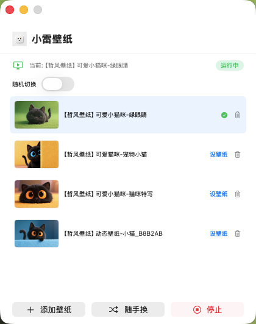

# 小雷壁纸 (XiaoLeiWallpaper)

把 MP4 视频设为 Mac 桌面壁纸，支持多显示器、随机切换。

## 效果展示



- **视频桌面壁纸**：将任意 MP4 视频设为桌面壁纸，静音循环播放
- **多显示器支持**：所有外接屏幕同步显示，插拔显示器自动适配
- **壁纸库**：上传管理多个视频壁纸，一键切换
- **随机切换**：支持定时随机切换（1 分钟 / 5 分钟 / 15 分钟 / 30 分钟 / 1 小时）
- **自动恢复**：睡眠唤醒、解锁后自动恢复播放
- **资源优化**：限制视频码率、显示器休眠自动暂停，减少 CPU/GPU 占用

## 系统要求

- macOS 13+
- Swift 5.9

## 下载安装

从 [Releases](https://github.com/programmerloverun/XiaoLeiWallpaper/releases) 下载最新 DMG，拖入 `/Applications` 即可。

首次打开时，如果系统提示「无法验证开发者」，请到 **系统设置 → 隐私与安全性** 中点击「仍要打开」。

## 构建

```bash
# 仅构建（未签名）
make app

# 输出：.build/小雷壁纸.app
```

## 独立分发（签名 + 公证 + DMG）

### 前提条件

1. **Apple Developer Program**（$99/年）— [developer.apple.com](https://developer.apple.com)
2. **Developer ID Application 证书** — Xcode → Settings → Accounts → Manage Certificates
3. **App 专用密码** — [appleid.apple.com](https://appleid.apple.com) → 登录与安全 → App 专用密码
4. **Team ID** — [developer.apple.com/account](https://developer.apple.com/account) 会员页面查看

### 一键发布

```bash
make release \
    DEV_ID='Developer ID Application: Your Name (XXXXXXXXXX)' \
    APPLE_ID='you@example.com' \
    TEAM_ID='XXXXXXXXXX' \
    APP_PASSWORD='xxxx-xxxx-xxxx-xxxx'
```

流程：构建 → 签名 → 公证 → 装订票据 → DMG

### 分步执行

```bash
make build                              # 编译
make sign DEV_ID='Developer ID...'      # 签名
make notarize APPLE_ID=... TEAM_ID=... APP_PASSWORD=...  # 公证
make staple                             # 装订票据
make dmg                                # 创建 DMG
```

输出：`.build/小雷壁纸-1.0.0.dmg`，上传到 GitHub Releases 分发。

## 发布前检查

- [ ] 替换 `XiaoLeiWallpaper.icns` 为自己设计的图标
- [ ] Apple Silicon 和 Intel Mac 上均已测试
- [ ] 验证公证：`spctl -a -v .build/小雷壁纸.app`
- [ ] 在 GitHub Releases 中上传 DMG

## 技术实现

- **SwiftUI + AppKit**：界面用 SwiftUI，壁纸引擎用 AppKit（`NSWindow` + `AVPlayerLayer`）
- **窗口层级**：`CGWindowLevelForKey(.desktopIconWindow) - 1`，位于桌面图标下方
- **热切换**：使用 `AVPlayer.replaceCurrentItem` 替换视频，无需销毁重建窗口
- **多屏**：共享 `AVPlayer`，每个屏幕独立 `AVPlayerLayer`
- **节能**：`preferredPeakBitRate = 4Mbps`，显示器休眠时暂停播放

## 许可

MIT License — 详见 [LICENSE](LICENSE)
